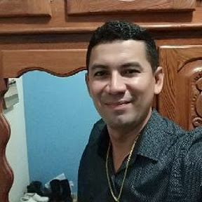

# Meu perfil
{width=6%}  
**Nome:** Jeconias Freitas  
**Idade:** 39  
**SExo:**  Masculino  
**Nacionalidade:** Brasileiro  
**Endereço:** Tv Raimundo Uchôa de Carvalho, 35, Pajuçara  
**email:** jecofreitas5@gmail.com  
**Telefone:** (93)991294576  
**Escolaridade:** Ensino Superior  
**Curso:** Engenharia de Aquicultura

Com uma abordagem verdadeiramente multivacional, minhas habilidades transcendem fronteiras e se adaptam a uma variedade de cenários. Sou um especialista em navegar por diferentes culturas e contextos, encontrando soluções inovadoras e eficazes em ambientes diversos. Minha capacidade de comunicação se destaca, permitindo-me conectar e colaborar com indivíduos de origens variadas. Além disso, minha flexibilidade e pensamento estratégico são as ferramentas essenciais que utilizo para enfrentar desafios complexos. Em resumo, minha bagagem multivacional não é apenas uma característica, mas sim um diferencial que potencializa minha capacidade de prosperar em qualquer ambiente.

# Corrículo Lattes
Olá, caros colegas e membros da comunidade acadêmica,

Apaixonado por explorar o mundo, encontro na viagem uma fonte de inspiração. Meu espírito aventureiro se reflete não apenas nas descobertas culturais, mas também na prática esportiva, onde desafios se transformam em conquistas pessoais. Nos momentos de lazer, minha curiosidade se manifesta, absorvendo conhecimento e desvendando curiosidades. No ambiente de trabalho, aplico minha adaptabilidade e resiliência, transformando desafios em oportunidades de aprendizado constante. Assim, minha jornada é uma fusão entre a busca incessante por novos horizontes, a energia esportiva e a sede de conhecimento, criando uma sinfonia única e enriquecedora.

Atenciosamente,

Jeconias Freitas

[Currículo Lattes](https://wwws.cnpq.br/)

# Redes Sociais
Minhas redes sociais.

[Facebook](https://www.facebook.com/)  {width=3%} 

[Instagram](https://www.google.com/)
{width=4%}

[X ex Twitter](https://twitter.com/?lang=pt)
{width=3%}

# Sobre
**Equipe:**  
**Orientador:**  Cralos Zazar  
**Munitores:** Danilo Pinto, Gabriel Rodrigues e Luan Patrick  
**Discentes:** Jeconias Freitas  
**Objetivos:**
O curso tem o intuito de ensinar os discentes da universidade Federal do Oeste do Pará (UFOPA) *COMUS* monte Alegre a linguagem de programação. Eles irão aprender a ultilizar os programas de versionamento Git e Github, construir roteiros no RMarkdown, criar Dashboards Interativo e aplicativos no R Shiny.
Esse Projeto servirá par ajudar em disciplina que envolveram a utilização do prgrama R, em trabalhos acadêmicos e no enriquecimento do conhecimento em programação muito exigido no mercado de trabalho.
